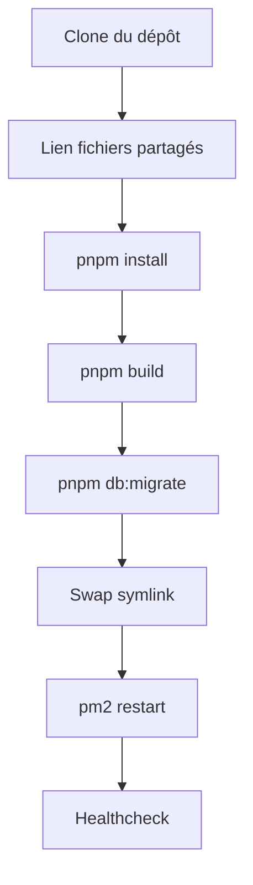

# Guide de mise à jour de Pinguin BOAT

> Trois méthodes pour mettre à jour votre instance. La méthode recommandée est le déploiement depuis le panel owner.

---

## 1. Mise à jour depuis le panel owner (recommandée)

La méthode la plus simple et la plus sécurisée. Elle ne nécessite aucune connexion SSH.

### 1.1 Prérequis

- Accès au panel owner (authentifié et 2FA validé)
- Variables configurées dans le `.env` :
  - `GITHUB_REPO=utilisateur/pinguin-boat`
  - `GITHUB_BRANCH=main`
  - `GITHUB_TOKEN=...` (si dépôt privé)

### 1.2 Procédure

1. Connectez-vous au dashboard : `https://votre-domaine.com`
2. Cliquez sur votre avatar en bas à gauche > **Panel Owner**
3. Validez le code 2FA
4. Dans le menu de gauche, cliquez sur **Déploiement**
5. Cliquez sur **Lancer un déploiement**
6. Le panel affiche les logs en temps réel :

```
Déploiement v1714512345678 démarré
Clonage du dépôt...
Dépôt cloné
Installation des dépendances...
Dépendances installées
Build du projet...
Build terminé
Migration de la base de données...
Migrations appliquées
Vérification de santé...
Vérification de santé réussie
Lien symbolique mis à jour
✅ Déploiement terminé avec succès !
```

### 1.3 Que se passe-t-il en coulisses ?

Le déploiement automatisé effectue les opérations suivantes dans l'ordre :

1. **Clone** le dépôt GitHub (shallow clone, profondeur 1)
2. **Crée des liens symboliques** vers les fichiers partagés (`.env`, `node_modules`, `prisma`)
3. **Installe les dépendances** avec `pnpm install --frozen-lockfile`
4. **Génère le client Prisma** avec `pnpm db:generate`
5. **Exécute le build** avec `pnpm build`
6. **Applique les migrations** avec `pnpm db:migrate`
7. **Effectue un swap atomique** du lien symbolique `current`
8. **Redémarre les services** PM2
9. **Vérifie l'état de santé** des services

### 1.4 Vérification

- Le statut passe à **SUCCESS** dans le panel
- Un nouveau changelog peut être créé depuis le panel
- Les services sont redémarrés automatiquement

---

## 2. Mise à jour manuelle via le script update.sh

### 2.1 Procédure

```bash
# En tant que root ou utilisateur avec droits sudo
sudo bash /opt/pinguinboat/current/scripts/update.sh
```

### 2.2 Ce que fait le script

1. Il lit la version actuelle dans `package.json`
2. Il appelle `deploy.sh` avec un nom de release horodaté
3. Le déploiement s'exécute (clone + build + migrations + swap)

### 2.3 Sortie attendue

```
🔄 Mise à jour Pinguin BOAT
📦 Version actuelle : "0.1.0-alpha"
🚀 Déploiement Pinguin BOAT - manual-20250101-120000
📥 Clonage de ...
📦 Installation des dépendances...
🔨 Build...
🗄️  Migrations...
🔄 Activation de la nouvelle release...
🔄 Redémarrage des services...
✅ Déploiement terminé avec succès !
📦 Nouvelle release : manual-20250101-120000
✅ Mise à jour terminée.
```

---

## 3. Mise à jour via SSH (méthode manuelle complète)

### 3.1 Se connecter au serveur

```bash
ssh root@votre-domaine.com
```

### 3.2 Créer une nouvelle release

```bash
RELEASE_NAME="update-$(date +%Y%m%d-%H%M%S)"
mkdir -p /opt/pinguinboat/releases/$RELEASE_NAME
```

### 3.3 Cloner la dernière version du code

```bash
cd /opt/pinguinboat/releases/$RELEASE_NAME
git clone --depth 1 --branch main https://github.com/utilisateur/pinguin-boat.git .
```

### 3.4 Lier les fichiers partagés

```bash
ln -sf /opt/pinguinboat/shared/.env .env
ln -sf /opt/pinguinboat/shared/node_modules node_modules 2>/dev/null || true
```

### 3.5 Installer les dépendances

```bash
pnpm install --frozen-lockfile
```

### 3.6 Build

```bash
pnpm build
```

### 3.7 Appliquer les migrations

```bash
pnpm db:migrate
```

### 3.8 Switcher le lien symbolique

```bash
ln -sfn /opt/pinguinboat/releases/$RELEASE_NAME /opt/pinguinboat/current
```

### 3.9 Redémarrer les services

```bash
pm2 restart all --update-env
```

### 3.10 Vérifier

```bash
pm2 status
curl http://localhost:4000/api/health
```

---

## 4. Que faire en cas d'échec

### 4.1 Le build échoue

```bash
# Vérifiez les logs
pm2 logs pinguin-api --lines 50

# Causes possibles :
# - Dépendances manquantes → pnpm install
# - Erreur TypeScript → pnpm typecheck
# - Package manquant → vérifiez le lockfile

# Solution : corrigez le problème dans le code et relancez le déploiement
```

### 4.2 Les migrations échouent

```bash
# Vérifiez l'état de Prisma
npx prisma migrate status

# Si une migration est en conflit :
npx prisma migrate resolve --rolled-back "nom_de_la_migration"

# Réappliquez :
pnpm db:migrate
```

### 4.3 Le service ne redémarre pas

```bash
# Redémarrage forcé
pm2 stop pinguin-api pinguin-bot pinguin-web
pm2 start /opt/pinguinboat/current/deploy/pm2.config.json

# Vérification manuelle
node /opt/pinguinboat/current/apps/api/dist/apps/api/src/index.js
```

### 4.4 Procédure d'urgence

Si la mise à jour échoue et que le service est down :

```bash
# 1. Restaurer l'ancienne version
ln -sfn /opt/pinguinboat/releases/NOM_ANCIENNE_VERSION /opt/pinguinboat/current

# 2. Redémarrer
pm2 restart all --update-env

# 3. Analyser l'échec
cat /opt/pinguinboat/releases/NOUVELLE_VERSION/.turbo/turbo-build.log
```

---

## 5. Conservation des données et fichiers sensibles

Les fichiers suivants sont conservés entre les releases (dans `/opt/pinguinboat/shared/`) :

| Fichier / Dossier | Chemin partagé             | Description          |
|-------------------|----------------------------|----------------------|
| `.env`            | `shared/.env`              | Configuration        |
| `logs/`           | `shared/logs/`             | Logs PM2             |
| `uploads/`        | `shared/uploads/`          | Fichiers uploadés    |

### Protection des données

- La base de données **n'est pas modifiée** pendant le swap de release
- Les migrations Prisma sont appliquées avant le swap
- En cas d'échec, un rollback est possible sans perte de données
- Les backups automatiques sont dans `backups/`

---

## 6. Processus de build et migrations automatiques

### Ordre d'exécution lors d'un déploiement



### Particularités

- **pnpm install** utilise `--frozen-lockfile` pour garantir la reproductibilité
- **pnpm build** compile tout le monorepo via Turborepo (cache activé)
- **pnpm db:migrate** utilise `prisma migrate deploy` (pas `dev`)
- Le swap de symlink est **atomique** : `ln -sfn` + `mv -Tf`

---

## 7. Redémarrage des services

### Via PM2

```bash
# Redémarrer tous les services
pm2 restart all

# Redémarrer un service spécifique
pm2 restart pinguin-api
pm2 restart pinguin-bot
pm2 restart pinguin-web

# Recharger la configuration
pm2 reload all
```

### Depuis le panel owner

1. Dashboard > Panel Owner > **Services**
2. Cliquez sur **Redémarrer** pour le service souhaité (API, Bot, Web)

### Automatique

Les services PM2 sont configurés avec :

- **max_restarts** : 10 tentatives avant de passer en `errored`
- **restart_delay** : 5000 ms entre chaque tentative
- **max_memory_restart** : redémarrage automatique si dépassement mémoire

| Service      | Limite mémoire | Mode      |
|-------------|----------------|-----------|
| pinguin-api | 500 MB         | fork      |
| pinguin-bot | 800 MB         | fork      |
| pinguin-web | 500 MB         | cluster (2 instances) |

---

## Annexes

### Vérifier la version actuelle

```bash
cat /opt/pinguinboat/current/package.json | grep version
```

### Lister les releases disponibles

```bash
ls -la /opt/pinguinboat/releases/
```

### Voir le lien symbolique actuel

```bash
readlink -f /opt/pinguinboat/current
```

---

> **Prochaine étape** : Consultez `ROLLBACK_FR.md` pour savoir comment revenir en arrière en cas de problème.
