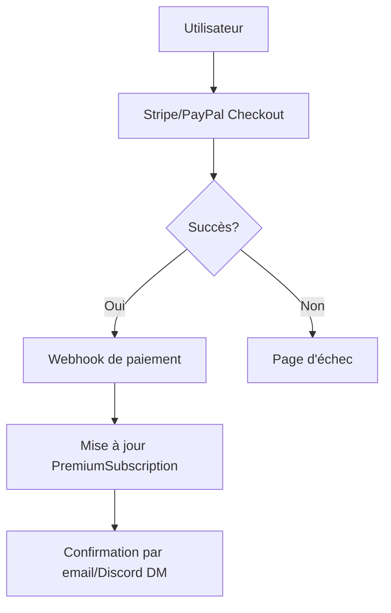
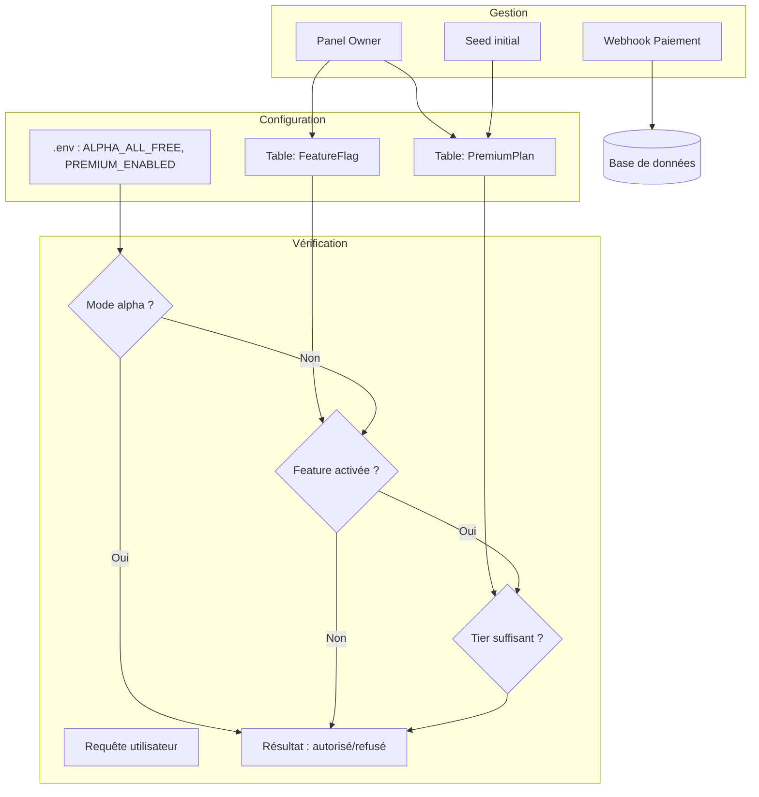

# Architecture Premium — Pinguin BOAT

> Documentation du système freemium, des plans tarifaires, des feature flags, et de l'architecture des abonnements.

---

## 1. Architecture freemium

### 1.1 Principe

Pinguin BOAT utilise un modèle **freemium** :

- **Free** : fonctionnalités de base, limitations en nombre de serveurs
- **Payant** (futur) : fonctionnalités avancées, serveurs illimités, support prioritaire

### 1.2 Fonctionnement actuel (alpha)

Le projet étant en alpha (`v0.1.0-alpha`), le mode alpha tout gratuit est activé par défaut via la variable :

```env
ALPHA_ALL_FREE=true
```

En mode alpha, **toutes les fonctionnalités sont débloquées gratuitement**, sans limitation de serveurs. Ce mode permet de :

- Tester l'intégralité du bot avant le lancement payant
- Recueillir des retours utilisateurs
- Stabiliser l'infrastructure
- Préparer la transition vers le modèle payant

### 1.3 Passage futur au payant

Quand le système payant sera activé (en désactivant le mode alpha), les limitations suivantes s'appliqueront selon le plan.

---

## 2. Plans tarifaires

### 2.1 Plans disponibles

| Plan       | Prix    | Serveurs max | Fonctionnalités                          |
|------------|---------|--------------|------------------------------------------|
| **FREE**   | Gratuit | 1 serveur    | Modules de base (modération, logs, etc.) |
| **BASIC**  | 2 €/mois| 3 serveurs   | Premium + musique, niveaux, économie     |
| **PRO**    | —       | 10 serveurs  | Tout sauf entreprise                     |
| **ENTERPRISE** | —  | Illimité     | Tout, support prioritaire, marque blanche|

> Les prix sont donnés à titre indicatif pour la version finale. Ils peuvent évoluer.

### 2.2 Plan FREE

**Limitations** :
- 1 serveur maximum
- Modules disponibles : modération, logs, tickets, suggestions, sondages
- Dashboard standard
- Pas de musique, économie, niveaux, giveaways

### 2.3 Plan BASIC (2 €/mois)

**Limitations** :
- 3 serveurs maximum
- Modules disponibles : FREE + musique, économie, niveaux, giveaways, welcome
- Dashboard avec plus de statistiques
- Support prioritaire

### 2.4 Plan PRO

**Limitations** :
- 10 serveurs maximum
- Tous les modules disponibles
- Dashboard complet
- Analyses avancées
- API rate limit augmenté

### 2.5 Plan ENTERPRISE

**Avantages** :
- Serveurs illimités
- Tous les modules et fonctionnalités
- Support dédié
- Marque blanche possible
- Déploiement personnalisé
- SLA garanti

---

## 3. Feature flags par plan

### 3.1 Structure

Les feature flags sont stockés en base de données dans la table `FeatureFlag` :

```prisma
model FeatureFlag {
  id        String   @id @default(uuid())
  key       String   @unique
  name      String
  description String?
  enabled   Boolean  @default(false)
  minTier   PremiumPlanTier
  createdAt DateTime @default(now())
  updatedAt DateTime @updatedAt
}
```

### 3.2 Flags et plans requis

| Feature Flag          | Description                        | Plan minimum |
|-----------------------|------------------------------------|--------------|
| `moderation`          | Commandes de modération            | FREE         |
| `logs`                | Logs d'activité                    | FREE         |
| `tickets`             | Système de tickets                 | FREE         |
| `suggestions`         | Suggestions                        | FREE         |
| `polls`               | Sondages                           | FREE         |
| `protection`          | Anti-raid, anti-spam, etc.         | BASIC        |
| `music`               | Musique en vocal                   | BASIC        |
| `economy`             | Économie, boutique                 | BASIC        |
| `levels`              | Niveaux et XP                      | BASIC        |
| `giveaways`           | Giveaways                          | BASIC        |
| `welcome`             | Messages de bienvenue              | BASIC        |
| `autoroles`           | Rôles automatiques                 | BASIC        |
| `embeds`              | Embeds personnalisés               | BASIC        |
| `automod_advanced`    | Auto-modération avancée            | PRO          |
| `backup`              | Sauvegarde des configurations      | PRO          |
| `analytics`           | Analyses avancées                  | PRO          |
| `whitelabel`          | Marque blanche                     | ENTERPRISE   |
| `priority_support`    | Support prioritaire                | ENTERPRISE   |

### 3.3 Vérification côté API

```typescript
// Exemple de vérification de feature flag
async function checkFeature(guildId: string, feature: string): Promise<boolean> {
  if (config.ALPHA_ALL_FREE) return true;
  
  const guild = await prisma.guild.findUnique({ where: { id: guildId } });
  if (!guild) return false;
  
  const flag = await prisma.featureFlag.findUnique({ where: { key: feature } });
  if (!flag || !flag.enabled) return false;
  
  return getTierLevel(guild.premium) >= getTierLevel(flag.minTier);
}
```

---

## 4. Paiements prévus

### 4.1 Méthodes de paiement

Le système de paiement n'est pas encore implémenté. Les méthodes prévues sont :

- **PayPal** : abonnements récurrents via PayPal Subscriptions
- **Crypto-monnaies** : paiements en ETH, USDT, BTC (via Stripe ou traitement direct)
- **Cartes bancaires** : via Stripe Connect

### 4.2 Architecture de paiement (à développer)



### 4.3 Webhook de paiement

L'API expose une route `/api/webhooks/payment` qui sera appelée par Stripe/PayPal pour confirmer les paiements.

---

## 5. Stockage des abonnements

### 5.1 Modèle de données

```prisma
model PremiumPlan {
  id          String   @id @default(uuid())
  name        String   @unique  // FREE, BASIC, PRO, ENTERPRISE
  description String?
  price       Float    @default(0)
  maxServers  Int      @default(1)
  features    String[] // Liste des feature flags débloqués
  createdAt   DateTime @default(now())
}

model PremiumSubscription {
  id        String   @id @default(uuid())
  userId    String   @unique
  guildId   String?  @unique
  planId    String
  plan      PremiumPlan @relation(fields: [planId], references: [id])
  status    SubscriptionStatus @default(ACTIVE)
  startedAt DateTime @default(now())
  expiresAt DateTime?
  canceledAt DateTime?
  createdAt DateTime @default(now())
  updatedAt DateTime @updatedAt
}

enum SubscriptionStatus {
  ACTIVE
  CANCELLED
  EXPIRED
  PAST_DUE
}
```

### 5.2 Seed des plans

```bash
pnpm db:seed
```

Le seed crée les 4 plans premium dans la base de données.

---

## 6. Comment configurer depuis le panel owner

### 6.1 Activer/désactiver le mode alpha

```env
# .env
ALPHA_ALL_FREE=true   # Tout est gratuit (développement/test)
ALPHA_ALL_FREE=false  # Mode payant activé
```

Depuis le panel owner : **Premium** > **Mode alpha** > basculer.

### 6.2 Configurer les plans

Les plans sont pré-configurés via le seed. Pour les modifier :

1. Connectez-vous à la base de données :
   ```bash
   psql -U pinguin -d pinguinboat
   ```

2. Modifier un plan :
   ```sql
   UPDATE PremiumPlan SET maxServers = 5, price = 2.99 WHERE name = 'BASIC';
   ```

### 6.3 Feature flags

Depuis le panel owner : **Premium** > **Feature Flags** :

- Activez/désactivez chaque flag individuellement
- Associez un plan minimum à chaque flag
- Les changements sont immédiats

---

## 7. Limitations futures

### 7.1 Limitations par plan

| Fonctionnalité              | FREE | BASIC   | PRO     | ENTERPRISE |
|----------------------------|------|---------|---------|------------|
| Serveurs max               | 1    | 3       | 10      | ∞          |
| Musique                    | ❌   | ✅      | ✅      | ✅         |
| Économie                   | ❌   | ✅      | ✅      | ✅         |
| Niveaux / XP               | ❌   | ✅      | ✅      | ✅         |
| Giveaways                  | ❌   | ✅      | ✅      | ✅         |
| Anti-raid avancé           | ❌   | ❌      | ✅      | ✅         |
| Sauvegarde config          | ❌   | ❌      | ✅      | ✅         |
| Analyses                   | ❌   | ❌      | ✅      | ✅         |
| Marque blanche             | ❌   | ❌      | ❌      | ✅         |
| Support prioritaire        | ❌   | ❌      | ❌      | ✅         |
| File d'attente musique max | 0    | 50      | 200     | ∞          |
| Durée embed personnalisé   | 0    | 3/jour  | ∞       | ∞          |

### 7.2 Rate limiting par plan

| Plan       | Requêtes API / min |
|------------|-------------------|
| FREE       | 30                |
| BASIC      | 60                |
| PRO        | 120               |
| ENTERPRISE | 300               |

---

## 8. Diagramme de l'architecture premium



---

> **Prochaine étape** : Consultez `STRUCTURE_PROJET_FR.md` pour comprendre l'architecture du code.
