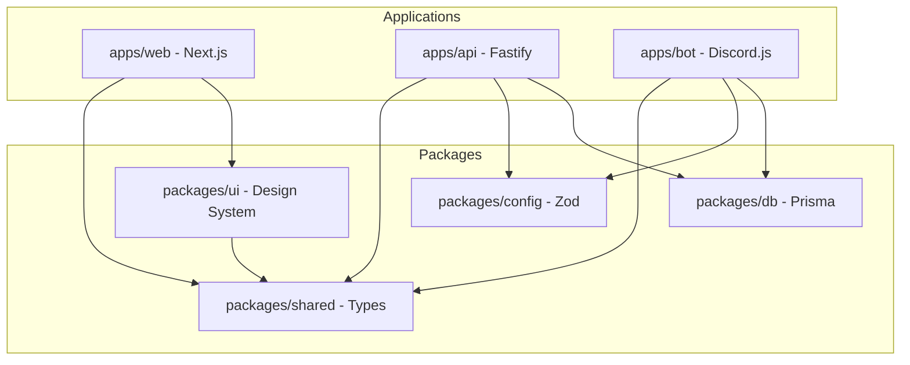

# Structure du projet — Pinguin BOAT

> Architecture monorepo, arborescence complète, dépendances entre packages et principes de conception.

---

## 1. Architecture monorepo

Pinguin BOAT est organisé en **monorepo** utilisant **pnpm workspaces** et **Turborepo**.

### 1.1 Pourquoi un monorepo ?

- **Partage de code** : types, configurations, clients de base de données centralisés
- **Build unifié** : Turborepo optimise le cache et l'ordre de build
- **Gestion des dépendances** : pnpm resolve les dépendances partagées
- **Cohérence** : même versions de TypeScript, ESLint, Prettier partout

### 1.2 Configuration pnpm

```yaml
# pnpm-workspace.yaml
packages:
  - 'apps/*'
  - 'packages/*'
```

### 1.3 Pipeline Turborepo

```json
{
  "pipeline": {
    "build": { "dependsOn": ["^build"] },
    "dev": { "cache": false, "persistent": true },
    "lint": {},
    "typecheck": {}
  }
}
```

L'ordre de build est automatiquement déterminé par le graphe de dépendances entre packages.

---

## 2. Arborescence complète

```
pinguin-boat/
├── .github/
│   └── workflows/              # CI/CD GitHub Actions
│
├── apps/
│   ├── web/                    # Dashboard Next.js
│   │   ├── lib/
│   │   │   ├── api.ts          # Client API (fonctions de fetch typées)
│   │   │   ├── auth.ts         # Authentification OAuth2 Discord
│   │   │   └── utils.ts        # Utilitaires frontend
│   │   ├── public/             # Assets statiques
│   │   └── ...                 # Pages, composants Next.js
│   │
│   ├── api/                    # API Fastify
│   │   └── src/
│   │       ├── index.ts        # Point d'entrée, configuration Fastify
│   │       ├── routes/
│   │       │   ├── auth.ts     # Routes d'authentification Discord OAuth2
│   │       │   ├── overview.ts # Routes de vue d'ensemble
│   │       │   ├── guilds.ts   # Routes de configuration des serveurs
│   │       │   ├── owner.ts    # Routes du panel owner
│   │       │   ├── deploy.ts   # Routes de déploiement/rollback
│   │       │   ├── music.ts    # Routes de musique (WebSocket)
│   │       │   └── webhooks.ts # Routes de webhooks (GitHub, etc.)
│   │       ├── middleware/
│   │       │   ├── auth.ts     # Middleware d'authentification
│   │       │   ├── owner.ts    # Middleware de vérification owner
│   │       │   └── validate.ts # Middleware de validation Zod
│   │       ├── services/
│   │       │   ├── owner2fa.ts  # Service 2FA (speakeasy + QR code)
│   │       │   ├── metrics.ts   # Métriques système (CPU, RAM, etc.)
│   │       │   ├── deploy.ts    # Service de déploiement (Git + build)
│   │       │   └── discord.ts   # Service d'appels API Discord
│   │       └── utils/
│   │           ├── response.ts  # Utilitaires de réponse standardisée
│   │           ├── permissions.ts # Vérification des permissions
│   │           └── webhook.ts    # Validation des webhooks
│   │
│   └── bot/                    # Bot Discord.js
│       └── src/
│           ├── index.ts        # Point d'entrée, démarrage du client
│           ├── commands/
│           │   ├── _loader.ts  # Chargeur automatique de commandes
│           │   ├── moderation/ # Commandes de modération
│           │   │   ├── ban.ts, kick.ts, mute.ts, warn.ts, purge.ts, etc.
│           │   ├── music/      # Commandes de musique
│           │   │   ├── play.ts, skip.ts, stop.ts, queue.ts, etc.
│           │   ├── economy/    # Commandes économiques
│           │   │   ├── balance.ts, daily.ts, shop.ts, transfer.ts, etc.
│           │   ├── levels/     # Commandes de niveaux
│           │   ├── giveaways/  # Commandes de giveaways
│           │   ├── tickets/    # Commandes de tickets
│           │   ├── welcome/    # Commandes de bienvenue
│           │   ├── autoroles/  # Commandes de rôles automatiques
│           │   ├── embeds/     # Commandes d'embeds
│           │   └── utility/    # Commandes utilitaires (ping, help, etc.)
│           ├── events/
│           │   ├── _loader.ts  # Chargeur automatique d'events
│           │   ├── ready.ts    # Event ready
│           │   ├── interactionCreate.ts  # Interactions
│           │   ├── messageCreate.ts      # Messages
│           │   ├── guildCreate.ts        # Ajout sur serveur
│           │   └── guildDelete.ts        # Retrait de serveur
│           ├── guards/
│           │   ├── permissions.ts # Guard de permissions
│           │   ├── blacklist.ts  # Guard de blacklist
│           │   ├── cooldown.ts   # Guard de cooldown
│           │   └── module.ts     # Guard d'activation de module
│           ├── services/
│           │   ├── logger.ts     # Service de logging
│           │   ├── embed.ts      # Service de création d'embeds
│           │   ├── xp.ts         # Service de gestion XP
│           │   └── music.ts      # Service de musique
│           └── utils/
│               └── register.ts   # Enregistrement des commandes slash
│
├── packages/
│   ├── config/                 # Configuration Zod
│   │   └── src/
│   │       ├── index.ts        # Validation et export du schéma .env
│   │       └── discord.ts      # Constantes Discord
│   │
│   ├── db/                     # Prisma ORM
│   │   ├── schema.prisma       # Schéma de la base de données
│   │   └── src/
│   │       ├── index.ts        # Export du client Prisma singleton
│   │       └── seed.ts         # Seed des données initiales
│   │
│   ├── shared/                 # Types partagés
│   │   └── src/
│   │       ├── index.ts        # Ré-export de tout le package
│   │       ├── enums.ts        # Énumérations (ThemeName, PremiumPlanTier, etc.)
│   │       ├── types.ts        # Interfaces partagées (GuildConfig, User, etc.)
│   │       ├── dto.ts          # DTOs pour les réponses API
│   │       ├── themes.ts       # Configuration des 10 thèmes
│   │       └── permissions.ts  # Bitfield de permissions
│   │
│   └── ui/                     # Design system
│       └── src/
│           ├── index.ts        # Export des composants
│           ├── hooks/
│           │   ├── useTheme.ts    # Hook de gestion des thèmes
│           │   ├── useSnowflakes.ts # Hook des flocons de neige
│           │   └── useMediaQuery.ts # Hook de media queries
│           └── utils/
│               ├── theme.ts    # Application des variables CSS de thème
│               └── cn.ts       # Utilitaire className (tailwind-merge)
│
├── scripts/                    # Scripts shell de déploiement
│   ├── install.sh              # Installation initiale du serveur
│   ├── deploy.sh               # Déploiement d'une nouvelle release
│   ├── update.sh               # Mise à jour manuelle
│   ├── rollback.sh             # Rollback vers une version précédente
│   ├── healthcheck.sh          # Vérification de santé des services
│   └── backup.sh               # Sauvegarde de la base de données
│
├── deploy/                     # Configuration de déploiement
│   ├── nginx.conf              # Configuration Nginx (proxy inverse, SSL)
│   └── pm2.config.json         # Configuration PM2 (3 services)
│
├── docs/                       # Documentation
│   ├── INSTALLATION_FR.md
│   ├── ACTIVATION_BOT_FR.md
│   ├── MISE_A_JOUR_FR.md
│   ├── ROLLBACK_FR.md
│   ├── OWNER_PANEL_FR.md
│   ├── THEMES_FR.md
│   ├── PREMIUM_ARCHITECTURE_FR.md
│   ├── STRUCTURE_PROJET_FR.md
│   └── CHECKLIST_PRODUCTION_FR.md
│
├── .env.example                # Exemple de configuration
├── package.json                # Scripts racine (build, dev, db:*)
├── pnpm-workspace.yaml         # Configuration workspace
├── turbo.json                  # Configuration Turborepo
├── tsconfig.json               # Configuration TypeScript de base
└── .npmrc                      # Configuration npm/pnpm
```

---

## 3. Architecture des dépendances



### Ordre de build

1. `@pinguin/shared` (aucune dépendance interne)
2. `@pinguin/config` (dépend de rien)
3. `@pinguin/db` (dépend de rien)
4. `@pinguin/ui` (dépend de `shared`)
5. `@pinguin/api` (dépend de `shared`, `config`, `db`)
6. `@pinguin/bot` (dépend de `shared`, `config`, `db`)
7. `@pinguin/web` (dépend de `shared`, `ui`)

---

## 4. Principes de conception

### 4.1 Séparation des responsabilités

Chaque application a un rôle distinct :

- **`apps/web`** : Interface utilisateur (Next.js), rendu côté serveur et client
- **`apps/api`** : API REST + WebSocket, logique métier centralisée
- **`apps/bot`** : Client Discord, gestion des événements en temps réel

### 4.2 Packages réutilisables

- **`packages/config`** : Toute la configuration est centralisée et validée par Zod. Pas de `process.env` dispersé dans le code.
- **`packages/db`** : Singleton Prisma, connexion unique partagée.
- **`packages/shared`** : Types, énumérations, DTOs — la source de vérité unique entre frontend et backend.
- **`packages/ui`** : Design system cohérent, hooks réutilisables.

### 4.3 Sécurité

- Validation des entrées avec Zod
- Sessions OAuth2 Discord
- 2FA obligatoire pour le panel owner
- Rate limiting sur l'API
- Blacklist utilisateurs et serveurs
- Headers de sécurité Nginx

### 4.4 Déploiement atomique

- Le lien symbolique `/opt/pinguinboat/current` pointe vers la release active
- Les migrations sont appliquées avant le swap
- Les anciennes releases sont conservées pour rollback
- Les fichiers sensibles (`.env`) sont partagés entre releases via `shared/`

### 4.5 Configuration via l'environnement

Toute la configuration passe par des variables d'environnement, validées par Zod au démarrage. Un échec de validation bloque le démarrage du service pour éviter les erreurs silencieuses.

---

> **Prochaine étape** : Consultez `CHECKLIST_PRODUCTION_FR.md` pour vérifier que votre installation est prête pour la production.
